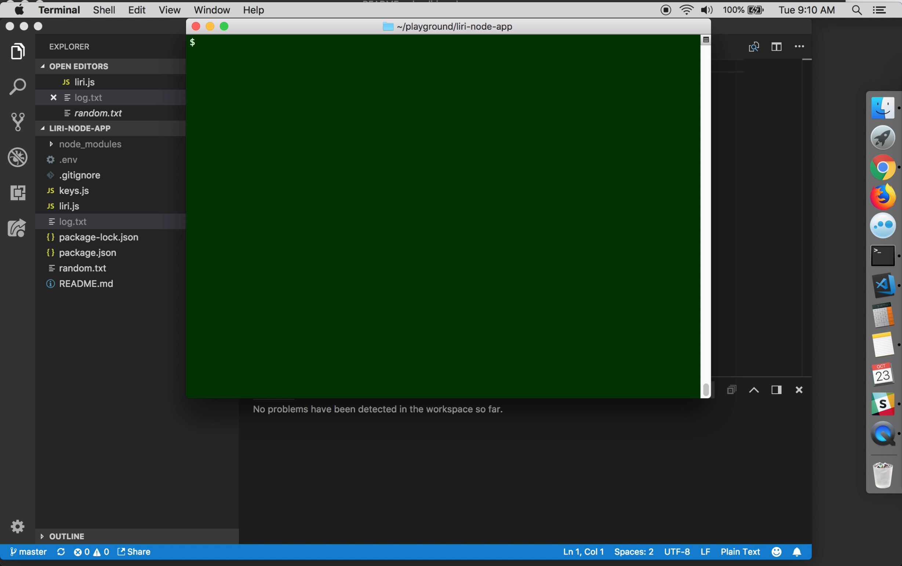

# liri-node-app

This Node.js application uses API calls to look up information on movies, songs, and bands on tour.  Movie information is pulled from the OMDB API; song information from Spotify through the node-spotify-api; and band tour dates from the Bandsintown API.

A fourth function, called "Do What It Says", takes its command from the file random.txt, which contains two strings: a directive that specifies which type of lookup to perform, and then the lookup itself.

All lookups are saved in a file called log.txt.

The following video demonstrates the use of this application.

